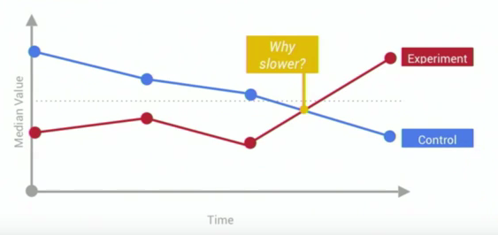
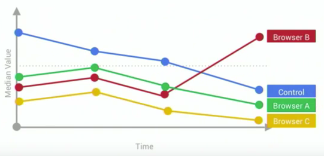
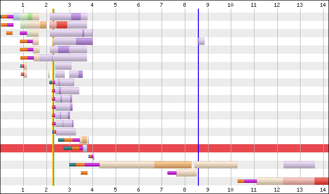

# Web 性能分析

> 本文整理自 YouTube 工程师 Rick Viscomi 的演讲 [Web Performance Testing](https://www.youtube.com/watch?v=k9dtjsLi9Lw)

本文介绍两种 Web 性能分析方法：Real User Monitoring（RUM），Synthetic Testing

- RUM，从“真实用户性能监控”的字面描述就能看出，我们收集用户在访问网站时的性能数据，这些数据反映了用户在我们网站的真实体验。
- Synthetic Testing，更像是一个实验室，通常用于在特定场景下的性能分析。

通过两种方式都能采集到性能数据，不同点是：RUM 用来衡量页面性能有多快，而 Synthetic Testing 用于分析如何让页面变得更快。

## Real User Monitoring（RUM）

要采集和分析 RUM 数据，最简单的方法是直接选择一个市面上符合你需求的性能分析产品。实际上 Google Analytics 就提供了这个功能。在 Google 内部，有一个自己定制的产品，叫 Client-side Instrumentation（CSI）。

RUM 可以分为三部分。首先，我们在客户端部署一段代码，这段代码可以获取页面性能和页面状态数据；然后，把这些数据打包并发送给分析服务器；最后服务器处理这些数据并提供一个仪表盘展示结果。

大部分 RUM 产品都会利用 navigation timing API 收集一些通用的性能指标，但我们最好再更进一步，结合自己的业务场景，分析影响用户真实体验的性能指标还有哪些。例如在 YouTube，他们会更关注用户什么时候能开始播放视频。

除此之外，任何其它可能影响性能的数据，我们都要考虑进去，例如运行环境等。在 YouTube，用户可能会开启一些实验性的功能，他们也会把这些信息收集进去，观察这些新功能是否影响性能。

统计数据最好默默地发送，不要影响用户的正常浏览。



这是性能分析控制台的一个图表示例，能够看到随时间变化的性能曲线，每个时间点的数值越低表示耗时越少、性能越好。通常取统计数据的中位数来代表性能的好坏。

其中红色对应实验组的性能曲线，蓝色对应基础组的性能曲线。两组数据比较，可以看到在倒数第二个节点之前，实验组的性能更好，从倒数第二个节点开始，实验组性能开始变差。为了找出性能变差的原因，可以将数据进一步分离。



这里将数据按浏览器进行分类，可以清晰地看出是 Browser B 导致了性能下降。由于用户的客户端环境差别很大，还可以按地区、设备类型等维度进行分类。

## Synthetic Testing

这里推荐一个免费的性能分析工具 Webpagetest，可以用它来做性能分析。Synthetic testing 一般会选取特定的测试环境，而不是从真实用户那里收集数据。在特定的网络环境下，反复测试多次，这样能保证测试结果更可靠。最后，可以根据测试结果数据分析我们关心的那些性能指标。Webpagetest 里可以对测试环境进行非常细致的定制，比如可以指定用 Chrome 浏览器在 3G 网络下进行测试。

由于 Webpagetest 是一个免费公开的测试工具，它运行在公共互联网环境中，如果你要测试公司内部的私有页面，需要自己部署一个私有的 Webpagetest 实例。



Webpagetest 的测试结果用瀑布图的形式展示，非常清晰直观，可以看到每个网络请求的时间节点，它还在瀑布流上注明了 Start Render 和 Dom Complete 等关键节点。用户还可以自己定制关键节点指标。

## 小结

RUM 需要我们从客户端采集数据，然后才能进行有价值的性能分析和监控。部署到客户端的代码必须保持轻量，且不能打扰用户的正常浏览。
Synthetic testing 设置的测试环境最好是比较典型、普遍的，比如选择有代表性的浏览器、设置合适的网络速度。在公司内网部署自己的 Webpagetest 服务，还能在新功能发布前就进行测试，提前发现性能问题。

## 相关资料

Navigation Timing API: https://developer.mozilla.org/en-US/docs/Web/API/Navigation_timing_API

《Using WebPageTest》:https://www.amazon.cn/dp/B016LI157G/
