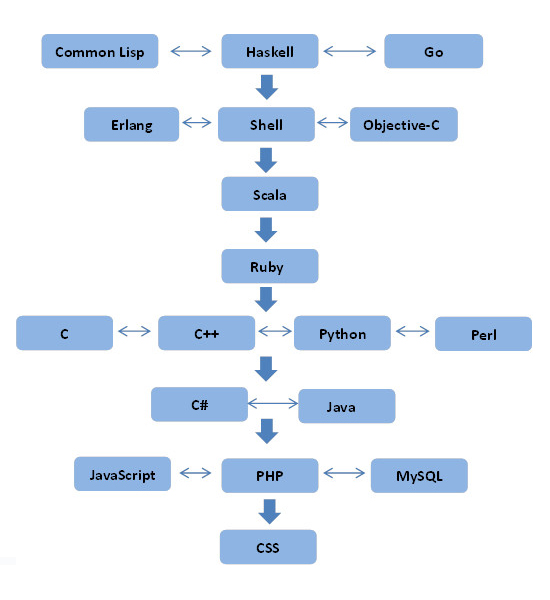

# 最前端

## 开始之前

- PPT 二维码
- VR 眼镜

## 关于主题

### 做个调查

- 前端工程师举手
- 自己会一点前端的举手
- 完全没写过前端代码的举手

### 程序员鄙视链
身处大数据中心这样一个部门，有很多大数据专家、分布式专家、区块链专家，相对来说前端是少数派，很多人跟前端接触较少，了解也比较少，我想通过这次分享，带大家进一步认识“前端”这个岗位。



这是网上随便找的一张鄙视链的图，不管是什么版本，JavaScript 都处于鄙视链偏底部的位置，在这张图里居然跟 PHP 平级了，简直不能忍。当然我也没有期待通过一次分享就咸鱼翻身，而是希望大家能对前端有更多的了解，然后有一个自己的判断。

### 为什么是“最”

“最”前端之“最”，是最前沿、最真实的前端。所以今天的演讲会从这两方面来介绍，一是前端业界最前沿的一些技术和应用场景，也就是大家普遍认为很高大上的那些技术，二是回归现实，看看现实生活中前端的工作和涉及的技术有哪些，我之前所在的团队做过哪些事情，现在万达的团队虽然时间很短，还没有什么特别出彩的，但也可以给大家介绍一下我们正在做的事情。

## 最前沿的前端


### VR

- videojs-vr
- WebVR 草案
- holojs

### 大数据可视化

- 大屏：DataV
- Three.js

### 客户端

- 网易云音乐
- 微信的本质是网页

### 还有

- IDE Visual Stdudio Code, Atom
- 区块链 bitcore (使用Javascript发送数据到区块链)
- 物联网 Johnny-Five
- 嵌入式 Ruff 
- 硬件开发 Cylon、Nodebots、Robotjs

### 还有

- j2js: 从 Java 字节码编译到 JavaScript
- Mandreel: 从 C++ 和 Objective-C 编译到 JavaScript
- Clue: 从 C 编译到 JavaScript
- Pyjaco: 从 Python 编译到 JavaScript
- rb2js: 从 Ruby 编译到 JavaScript
- Saltarelle: 从 C# 编译到 JavaScript
- Scala.js: 从 Scala 编译到 JavaScript
- Go2js: 从 Go 编译到 JavaScript

### Atwood's Law
“任何可以用JavaScript来写的应用，最终都会用JavaScript来实现。” -- Jeff Atwood

### Front End Moore's law
“每隔18个月，前端开发的难度难度会增加一倍。” -- 前端摩尔定律


#### Github 占比 (2016年)


#### npm 模块
npm 已经成为世界上最大的模块仓库，模块数量是 Maven 仓库的 2 倍，且继续保持爆发式增长，从2017年1月到2017年7月，模块数量从 35 万+增长到 47 万+

#### 工具链和生态环境巨变
2015 - 2017
主流框架：jQuery -> React、Vue
构建打包：gulp -> webpack
模块仓库：无 -> npm
Nodejs：v0.11.15 -> v8.2.1
语言规范：ES5 -> ES8

### JavaScript 语言

- 曾经的 JavaScript

类和继承

```javascript
function Human(age) {
  this.age = age;
}
Human.prototype.speak = function(sentence) {
  console.log(sentence);
};

var wang = new Human(18);
wang.speak('I am ' + wang.age + ' years old');
// output: I am 18 years old
```

Dom 操作

```html
<div>
  <button id="btn">show</button>
  <div id="dialog" style="display:none;">Hello JavaScript</div>
</div>
```

```javascript
$('#btn').on('click', function() {
  $('#btn').addClass('clicked');
  $('#dialog').show();
});
```


- 现在的 JavaScript

类和继承

```javascript
class Human {
  constructor(age) {
    this.age = age;
  }
  speak(sentence) {
    console.log(sentence);
  }
}

let wang = new Human(18);
wang.speak(`I am ${wang.age} years old`);
// output: I am 18 years old
```

Dom 操作

```javascript
import React from 'react';

class Demo extends React.Component {
  handleBtnClicked = () => {
    this.setState({
      isClicked: true
    });
  }

  render() {
    return <div>
      <button onClick={this.handleBtnClicked}>show</button>
      {isClicked && <div>Hello JavaScript</div>}
    </div>
  }
}
```

## 最真实的前端


## 参考链接
- https://www.zhihu.com/question/38100109/answer/75190865
- http://www.csdn.net/article/2013-11-04/2817389-JavaScript-World